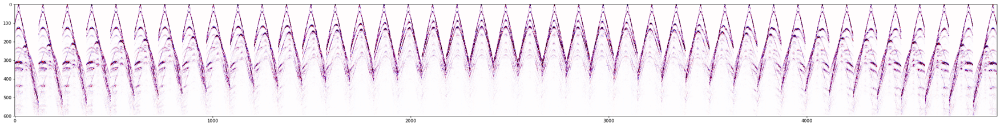
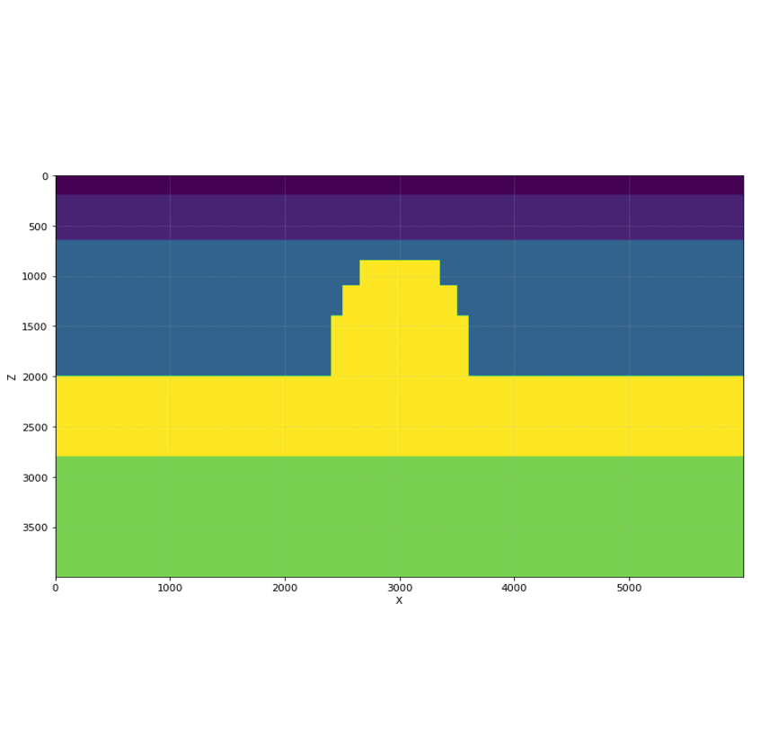
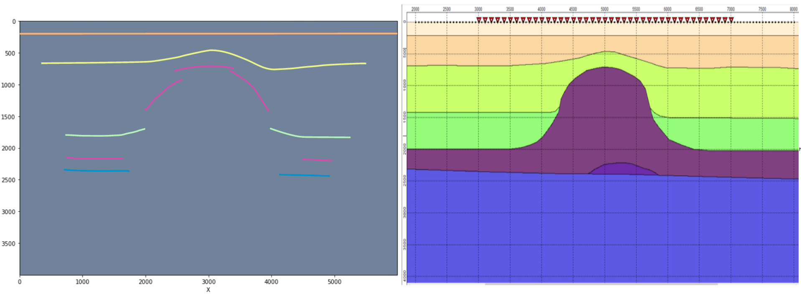
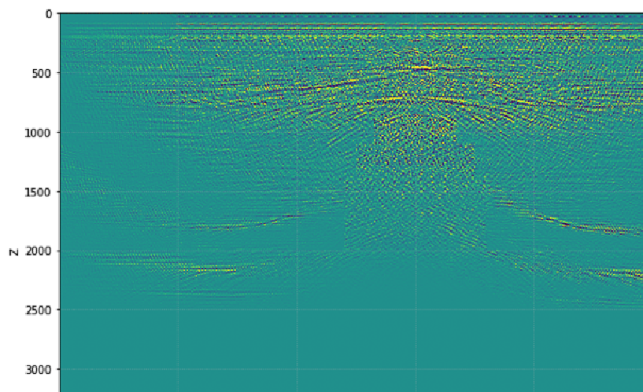

Seismic depth migration is a geophysical imaging process that transforms seismic reflection data from recorded time into true subsurface depth, correcting for wave travel paths and velocity variations to produce an accurate structural image of the Earth.

Seismic migration via Kondrashkov's Elliptical Reflection Decomposition (ERD) method is impemented in Jupyter Notebook.

Wavefield modeling is provided via special geophysical software:

Aprior velocity model is used for depth migration:

Tracking of borders between layers on the final image and Model, used for wavefield modeling

Final image after processing wavefield from picture 1 via Kondrashkov's Elliptical Reflection Decomposition (ERD) method

